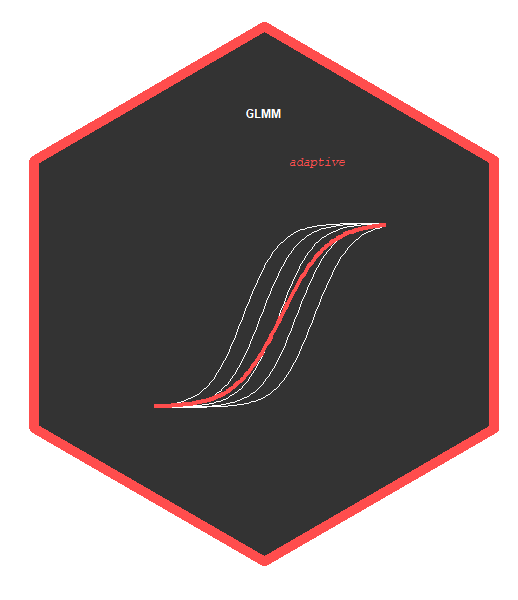

GLMMadaptive: Generalized Linear Mixed Models using Adaptive Gaussian Quadrature
================



[](https://travis-ci.org/drizopoulos/GLMMadaptive) [](https://cran.r-project.org/package=GLMMadaptive) [](https://CRAN.R-project.org/package=GLMMadaptive) [](http://www.rdocumentation.org/packages/GLMMadaptive) [](https://cran.r-project.org/package=GLMMadaptive) [](https://gitter.im/drizopoulos/GLMMadaptive)

Description
------------

This repository contains the source files for the R package <strong>GLMMadaptive</strong>. 
This package fits mixed effects models for grouped / repeated measurements data for which
the integral over the random effects in the definition of the marginal likelihood cannot
be solved analytically. The package approximates these integrals using the adaptive 
Gauss-Hermite quadrature rule.

Multiple random effects terms can be included for the grouping factor (e.g., random 
intercepts, random linear slopes, random quadratic slopes), but currently only a single
grouping factor is allowed.

Basic Features
------------

- The package contains a single model-fitting function named `mixed_model()` with four 
required arguments, `fixed` a formula for the fixed effects, `random` a formula for the
random effects, `family` a family object specifying the type of response variable, and 
`data` a data frame containing the variables in the previously mentioned formulas.

- Methods for standard generics are provided, i.e., `coef()`, `fixef()`, `ranef()`, 
`vcov()`, `logLik()`, `summary()`, `anova()`, `confint()`, `fitted()`, `residuals()`, 
and `predict()`.

- Negative binomial mixed models can be fitted using the `negative.binomial()` family 
object.

- Users may also specify their own log-density function for the repeated measurements 
response variable, and the internal algorithms will take care of the optimization.

- Calculates the marginalized coefficients using the idea of Hedeker et al. (2017) using 
function `marginal_coefs()`.

- Predictions with confidence interval for constructing effects plots are provided by 
function `effectPlotData()`.

Installation
------------

The development version of the package can be installed from GitHub using the **devtools**
package:
```r
devtools::install_github("drizopoulos/GLMMadaptive")
```

and with vignettes
```r
devtools::install_github("drizopoulos/GLMMadaptive", build_vignettes = TRUE)
```